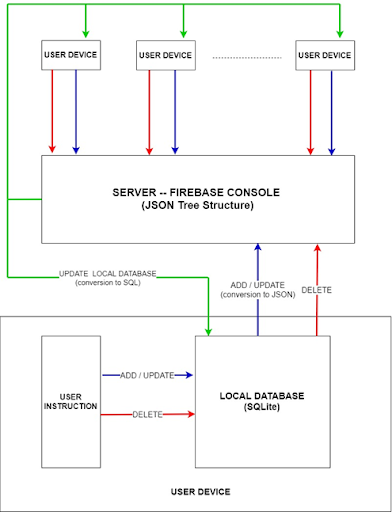
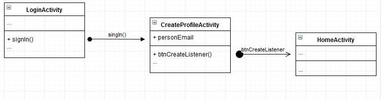
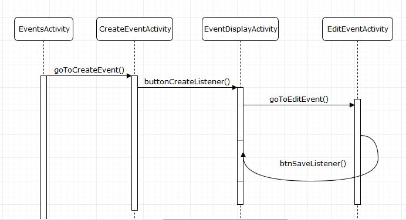

#OO Design & UML
###High-level architecture diagram

###Components
The diagram shows the workflow of the backend processes. On one hand, there is a local database, created in each of the user’s devices. It receives commands from the user and, at the same time, is listens for update instructions from the server. On the other hand, the server receives constant data from all users, converts the input into JSON object format and stores it in a tree structure.

###Static UML modeling aspect

###Dynamic UML modeling aspect

###Model Context
The first challenge we faced when we began working on the back-end architecture was providing the functionality required by our client and, at the same time, allowing ourselves to develop clear code so we can tackle any issues we might face with ease. We tried to limit ourselves to pre-existent technologies that were, to some extent or another, either developed for use in an Android environment or frequently used in this particular context. In order for all data to be stored in one place, so that the app may function appropriately, an online form of hosting was needed.

The use of this is storing all the data needed to run the app. This includes information about the users, i.e. name, surname, academic year, interests, etc. Furthermore, the back-end stows details about created events, comments and lists of participants for each of the events. This collection of information needs to be malleable, so data may be added, viewed, removed or updated whenever.

###Modeling Choice
Multiple attempts were undertaken at this stage, in order to find the best approach, some of which implied the use of either Oracle Cloud, MySQL or Google Firebase. During a few meetings with our mentor, we discussed the advantages and disadvantages of using each and every one of our methods. In the end, we decided the best way for us to achieve our task would be to keep going by the aforementioned principle. That is, using technologies that are highly compatible with the Android environment. Therefore, we chose to use Google Firebase as our means of online hosting.

Another advantage regarding this particular method is the sheer amount of provided documentation, both on the official website as well as in online forums. We also needed a means of storing the data locally, in order to assure easiness in fetching the appropriate information and the ability to view personal information even in an offline state. We decided to use the relational database management system called SQLite.

There are two primary reasons why we made this particular choice. One of them is that the SQL language is a familiar one, with a clear and straightforward syntax. The other one is that SQLite, particularly, is very frequently used in an Android environment, which would prove to be of great help when it comes to available online resources.
 
SQLite would allow us to construct a database which would be stored locally in each user’s device. This database would constantly listen to updates from the server and would update itself accordingly. Whenever a change was made locally, that change would automatically update the server as well, creating a constant sync between the online hosting environment and all devices which use the app.
 
In order to do the sync, the data from the relational database would be reconfigured into JSON objects, subsequently distributed in the Firebase Database and arranged into tree structures. Any byte maps from the local environment, usually used for storing pictures, would be encoded into string formats, using the renowned Base64 algorithm.

###What we learned
Probably the biggest learning outcome was that, when we first began working on this project, we had not considered how important and challenging the back-end architecture implementation could be, and how tough it would be to make a modeling choice. Another very problematic issue is that small errors and/or mistakes can create a domino effect in our model, essentially resulting in more voluminous issues when it comes to the functionality of our product.
