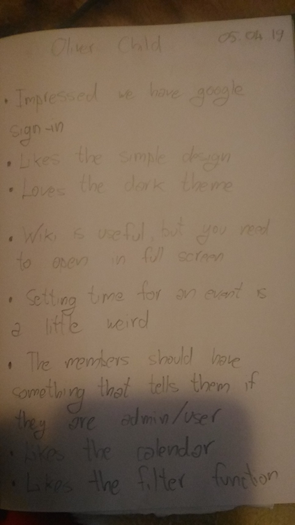

#Product Evaluation

We presented our app to CSS members and to Computer Science students and we had them use it, in order to get feedback on our project. We believed that having them use the app for the first time, without any explanations or tutorials, would offer us the best insights and would increase the possibility of finding hidden bugs. We documented every observation by writing notes.

The overall response was positive: most users believed the app was well designed and it had all the required functionality to be useful. However, many argued that the switch to a different platform for events could be undesirable when it can already be done through Facebook.

There were several aspects of the app which users were especially pleased with, such as the option of having a dark theme. Additionally, users were happy with the inclusion of the Wiki, and thought it could be a useful feature for CSS students.
On the other hand, we gathered observations towards other aspects of the app which users would like to be different. These are important to consider for future updates:

-The use of Google Sign-In instead of a University of Bristol SSO proved contradictory to some, as the log-in page requires users to enter their university credentials.

-Some users had trouble creating their profile or events due to not explicitly representing the images for these activities as mandatory.

-When presented with the Home screen, some users felt lost, as there are no guidelines as to what to do next, and the other activities are accessed through a drawer that is hidden unless opened. This was especially true when the Home page was empty.

-When choosing the academic year as “Postgraduate”, the profile page would instead display the academic year as “Year 5”.

-The “Date” field under events in Calendar is too far to the right.

The app was also presented to some committee members and the client, to confirm the validity of our app. It received approval from both sectors and they considered that the requirements were satisfied. Some of the most notable fixes suggested by the committee that were applied were:

-Having the start time and end time in of an event in separate fields, so that they can be changed individually

-Setting the Wiki page to open in desktop view, because users can’t modify it in mobile view

-When writing something in the app, the first letter was always lowercase, which troubled a lot of the users. We added an  attribute, so that the first letter is always uppercase

Notes from test session with Oliver Child, CSS committee member, in MVB, 05.04.2019:

