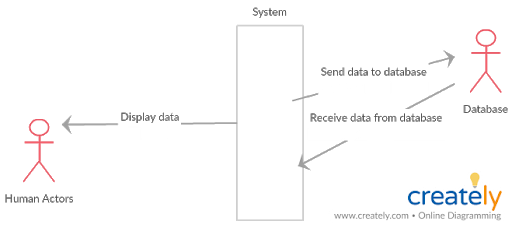
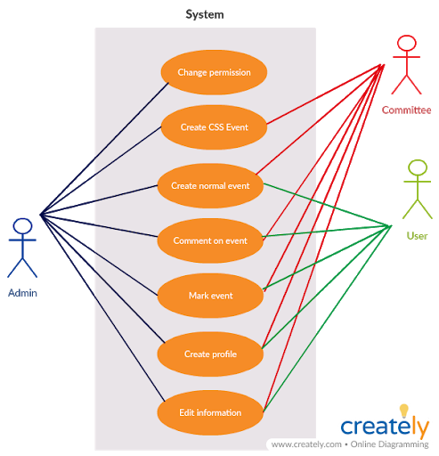
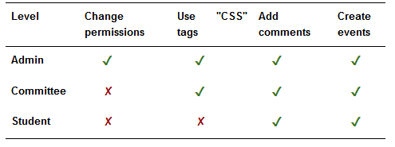

#Requirements
###Key human actors
**Users** : Everyone who has an University of Bristol account, but most of the users will probably be CSS members and Computer Science students, given the app’s content.

**Committee**: All the members of the Computer Science Society committee. They will be able to create CSS event and CSS planning events. CSS planning events are hidden from users.

**Admin**: The person that has access to all of the app’s functionalities. On top of having all the rights as a Committee, they could also change any user’s permission, being the only person capable of making another Admin or other Committees.
###Other stakeholders
**Developers**: The only people that are allowed to change the app’s code.

**General Public**: People that will be able to download and install the app, but would be unable to use it without an University of Bristol account.

**Google**: Because of the use of Google Sign-In and Firebase, Google could provide maintenance and assistance, if needed.

**Database Maintenance**: The people that will be assigned to maintain the database.

**Ad Companies**: The companies whose advertisements would appear on the app.

**Search Engines**: The app would appear if someone uses a search engine to look for it. In addition, people could also search for the Wiki.

**Investors**: People or companies that may want to invest or fund the app.

###Functional requirements
The main requirements the application must fulfill are for students to view upcoming CSS events, as well as planning and sharing their own events. Additionally, users must be able to add course notes on a shared wiki.

Regarding the users, each member must be able to log in with their MyBristol credentials. To do this we will use Google’s sign-in method, as the MyBristol login is based on gmail. Once logged in, they must be able to set up a profile which contains their info, a profile picture and the tags for events they are interested in. These details will then be saved on a back-end database created with SQL to store the information of each user.

The application must have different permissions for members depending on their position within the society. The three different levels are Admin, Committee and Student. Students can create and comment events. Committee members, in addition to student permissions, will be allowed to use “CSS” and “CSS Planning” tags. Admins, in addition to committee permissions, will be able to change other user’s permission level. This is done by configuring user’s permissions based on their email.

Regarding the events, they must be able to be added, edited and viewed from the application. Events must show details including their title, an image, a description, a date, time and duration, a location, tags visibility and which users are going. For attendance, users must be able to indicate if they are going to or are interested in the event. Furthermore, users must be able to comment on events and give specific dietary requirements. All the information regarding events will be stored in tables in the database.  The purpose of the tags are to filter events. There must also be a “CSS” and “CSS planning” tag which only the CSS committee should be able to add. The users must be able to filter the events by the tags they are interested in. Events tagged with the “CSS” tag must be visible by all users and must appear before all other events or on a separate tab. Only the CSS committee members should be able to view events tagged with the CSS planning tag.

Regarding the unit wiki, there must be different sections for each unit as well as a separation between each academic years. All of the users must be able to add and edit notes in the wiki. Again, the wiki will be stored in an SQL database.

The application must be usable at least on Android devices, this requirement is achieved by using Android Studio to build the application.

Further, optional requirements include custom sign-ups and data entries for event, such as creation of teams and joint sign-ups. Badges and achievements for users, a friends system with messaging, statistics, integration with google calendar, a dark theme, and a pizza equation which predicts the amount of pizza needed to be bought for an event.

The preferred assets to be used are the CSS logo, Bebas Neue font for titles and Open Sans font for text.

Many of the requirements are flexible.

1. **Login**
    1. Display Google Sign-in.
    2. Allow only University of Bristol accounts (@my.bristol.ac.uk).
    3. Verify credentials through Google Sign-in.
    4. Proceed to next activity if login is successful .
        1. Profile creation if new user. (4)
        2. Homepage if existing user. (3)
    5. Omit login if user is already signed-in.
2. **Profile creation**
    1. Allow users to select a profile picture, name and academic year.
        1. Set as mandatory fields.
    2. Allow users to select interested tags.
    3. Create a profile with the information given when clicking “Create” button.
    4. Proceed to Home activity upon profile creation. (3)
    5. Omit profile creation if user already has a profile.
3. **Homepage**
    1. Display created events.
        1. Display name, description and author of event.
        2. Direct to event view when clicked. (8)
    2. Display search bar.
        1. Return matching results if any are found.
    3. Display filter button.
        1. Remove all filters.
        2. Filter by tags.
        3. Filter by ‘CSS’ tag.
    4. Include toolbar. (13)
4. **Profile view**
    1. Display member’s profile picture, name, academic year and interests.
    2. Display events created by the member.
        1. Direct to event display when clicked. (8)
    3. If the profile is the user’s, display button to edit profile.
        1. Direct to edit profile. 
    5. If user is an admin, display button to change permissions.
    6. Include toolbar. (13)
5. **Profile edit**
    1. Allow users to edit their profile picture, name, academic year and interests.       
    2. Edit user profile with the new provided information after clicking “Save” button.
        1 Display current information in each field.
6. **Events**
    1. Include button for creating a new event. (7)
    2. Display events created by the user.
        1. Direct to the event when clicked. (8)
    3. Display events marked by the user.
        1. Direct to the event when clicked. (8)
    4. Include toolbar. (13)
7. **Event creation**
    1. Allow user to enter picture, name, date, time, location and description.
        1. Set fields as mandatory.
    2. Allow users to select tags for the event.
    3. Create an event with the information given when clicking “Create Event” button.
    4. Return to homepage upon event creation. (3)            
8. **Event view**
    1. Display name, picture, date, time, location, description and tags of event.
    2. Display number of users going to the event.
    3. Allow user to mark the event.
    4. Allow user to comment on the event.
    5. Display comments for the event.
        1. Display author, body, time and date of comment.
        2. If the user is the author of a comment, allow them to delete it.
    6. If the user is the creator of the event, include button to edit the event. (9)
    7. If the user is the creator of the event, include button to delete the event.
9. **Event edit**
    1. Allow edit of event picture, name, date, time, location, tags and description.
        1. Display current information for each field. 
    2. Edit event with the new information after clicking “Save” button.
10. **Calendar**
    1. Display a calendar with the current day selected by default.
    2. When selecting a day, show events for that day.
        1. Direct to event view when clicking on an event. (8)
    3. Include toolbar. (13)
11. **Members**
    1. Display list of members.
        1. Direct to profile view when clicking on a member. (4)
    2. Include search bar.
        1. Return matching results if any are found.
    3. Include toolbar. (13)
12. **Permissions**

13. **Toolbar**
    1. Display current activity title.
    2. Include navigation drawer.
        1. Navigation to home activity. (3)
        2. Navigation to user profile activity. (4)
        3. Navigation to events activity. (6)
        4. Navigation to calendar activity. (10)
        5. Navigation to members activity. (11)
        6. Navigation to settings activity. (12)
14. **App settings**
    1. Allow to switch between light and dark theme.
    2. Allow to switch between public or private profile.
    3. Include button to delete user profile.
    4. Include button to log out.
    5. Include toolbar. (13)

###Use case: planning an event. Sequence of steps :
1. User 1 logs in to the app through Google Sign-in.
2. User 1 is presented with the profile creation screen and creates a profile.
    2.1. User 1 enters picture, name, academic year and interests.
2.2. User 1’s profile is saved in the database.
3. User 1 navigates to “Events” through the toolbar’s navigation drawer.
4. User 1 creates an event.
    4.1. User 1 enters picture, title, date, time, location, tags, and description for event.
4.1. Event is saved in the database.
5. User 2 logs in to the app through Google Sign-in.
6. User 2 is presented with the profile creation screen and creates a profile.
    6.1. User 1 enters picture, name, academic year and interests.
    6.2. User 2’s profile is saved in the database.
7. User 2 navigates to “Calendar” through the toolbar’s navigation drawer.
8. User 2 clicks on the day set for User 1’s event.
9. User 2 is presented with all the events happening that day, including User 1’s event.
10. User 2 clicks on User 1’s event.
    10.1. User 2 is directed to the event.
11. User 2 marks User 1’s event.
    11.1 The number of users going to the event is updated in the database.
12. User 2 logs out.
13. User 1 selects the previously created event.
14. User 1 sees User 2 is going to the event.
15. User 1 logs out.
16. User 1 and User 2 happily enjoy the event together at the date, time and location set.

###Alternative Flows
**1. Users already have a profile created.**

When signing in, users will not be required to create a profile again. In this case, steps 2 and 6 (Profile creation) would be skipped for each user respectively.

**2. Users already have an open session on their device.**

If this is the case, users will be presented with the homepage right away. Here, steps 1 and 2 for User 1 are skipped and steps 5 and 6 are skipped for User 2.

**3. User 2 sees User 1’s event on the homepage.**

When User 1 creates the event, it is shown for all users on the homepage. Through here, User 2 can access the event in the same way, skipping steps 7 to 9. 

###Exceptional Flows
**1.User 1 deletes their profile before User 2 can see the event.**

When deleting one’s profile, all events created by that user will be eliminated alongside the profile. In this scenario, User 2 will never be able to see User 1’s event since it has been deleted from the database.

**2.User 1 loses connection while creating an event.**

In this scenario, User 1 will still be able to create the event and it will display for the author in the homepage. However, User 2 will not be able to see the event until User 1 regains connection to the database.

###Non-Functional Requirements
To ensure an adequate product quality for the application, it must meet a set of non-functional requirements, presented below.

1. **Design** 
    1. Achieve Google standards by referring to material.io guidelines.
    2. Express UoB CS Society brand through the use of preferred assets.
    3. Navigation drawer for easy use.
2. **Optimization**
    1. Less than 200ms response time for actions.
    2. Less than 1s response time between activities.
3. **Security**
    1. Google standards of security for user credentials through Google Sign-In.
    2. Protection against SQL injection with prepared statements.
4. **RAS**
    1. Reliability: the database must output the correct information within 3s.
    2. Availability: the service must not exceed 50 hours of downtime per year.
    3. Serviceability: if the service malfunctions, it must be repaired within 8 hours.

